# Zedex

<a href="docs/screenshots/demo-fullscreen.jpg">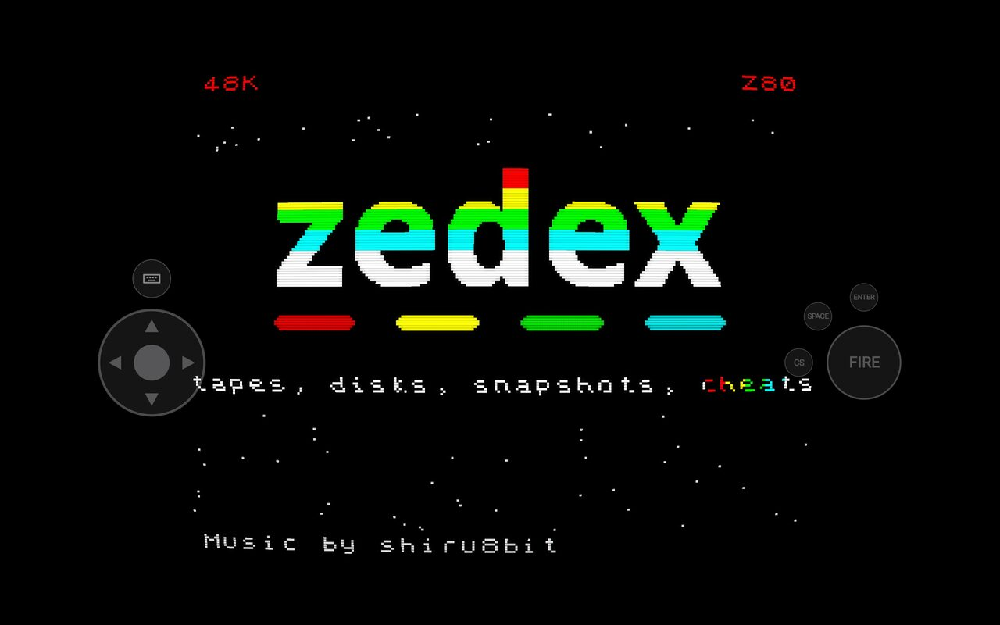</a>

A ZX Spectrum that behaves like a modern console. Save at any moment, put the
picture through the CRT you remember, pick up a controller and play. Nothing to
set up — every machine boots the moment you open the app.

Android 11 and later. The emulation is
[Fuse](http://fuse-emulator.sourceforge.net/), unmodified; the front end is
native. Most of the code was written by Claude, directed and reviewed by a
professional software developer.

Building, testing and releases: [docs/DEVELOPING.md](docs/DEVELOPING.md).
How Fuse is wired in: [docs/INTERNALS.md](docs/INTERNALS.md).

## Save states

<a href="docs/screenshots/states.jpg">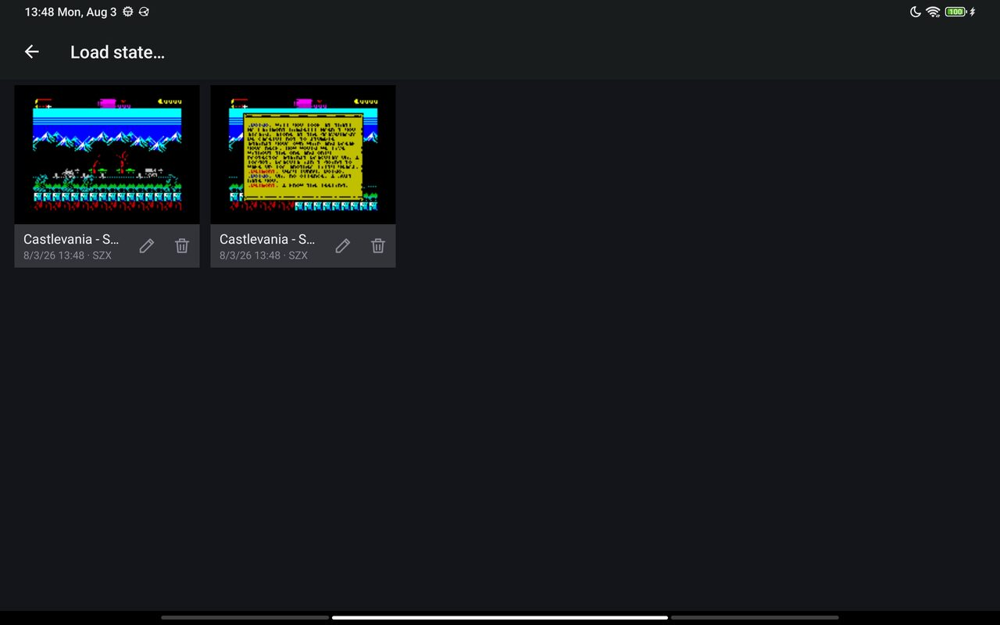</a>

Stop wherever you like. States are a grid of cards, each showing the screen it
holds, renamed and deleted on the card itself. Quick save and quick load sit on
the shoulder buttons — **Select + R1** and **Select + L1** — and are named after
whatever is running, so every game keeps its own pair. Written as SZX, Z80 or
SNA.

## Shaders

<a href="docs/screenshots/shaders.jpg">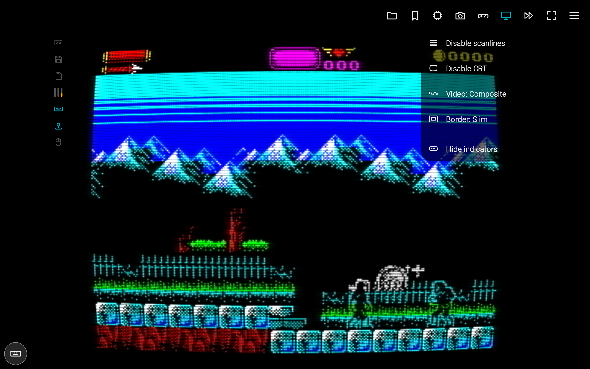</a>
<a href="docs/screenshots/settings-display.jpg">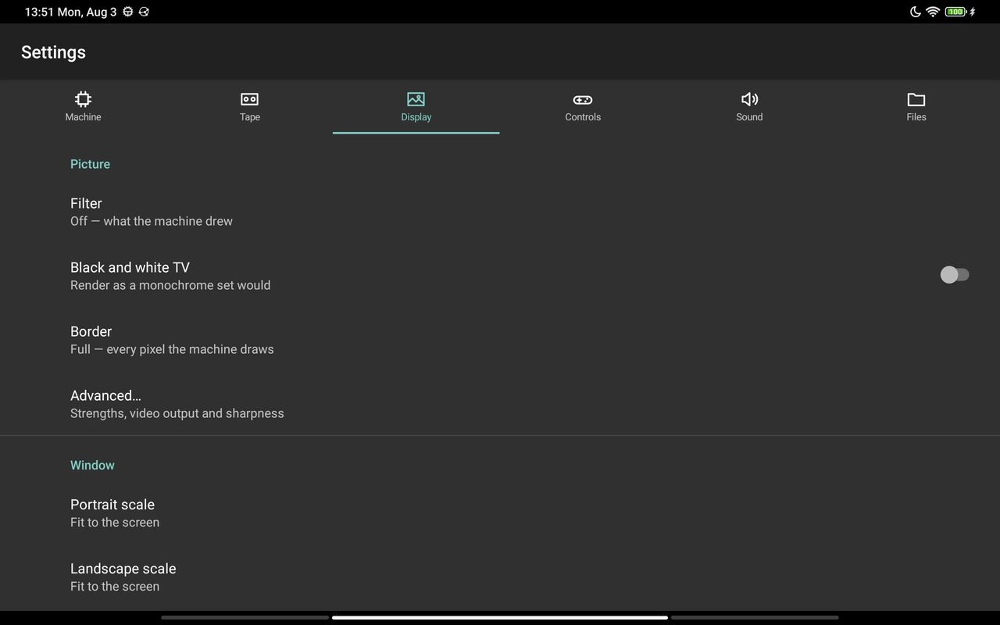</a>

- Scanlines, or a CRT with curvature, shadow mask and glow, or both together
- The signal: RGB, composite or RF, with colour bleed and noise
- A black-and-white television
- Every effect's strength and the sharpness are yours to set

Scaling runs on the GPU — fitted to the screen, or at a whole number of device
pixels per emulated pixel. Border in full, slimmed to a quarter, or cropped
away. Fullscreen leaves nothing but the picture and your thumbs.

## Dual screen

On a dual-screen handheld — an AYN Thor and its like — the controls, the menu
and the indicators move to the second panel entirely, leaving the first showing
nothing but the machine. The setting cannot be switched on with no panel to move
to, and unplugging one brings everything back.

Android decides which display an input method appears on, so the *Android
keyboard* skin usually opens over the machine. It still types into the Spectrum.

<!--  — the picture alone above, controls and lamps below -->

## Controllers

<a href="docs/screenshots/hotkeys.jpg">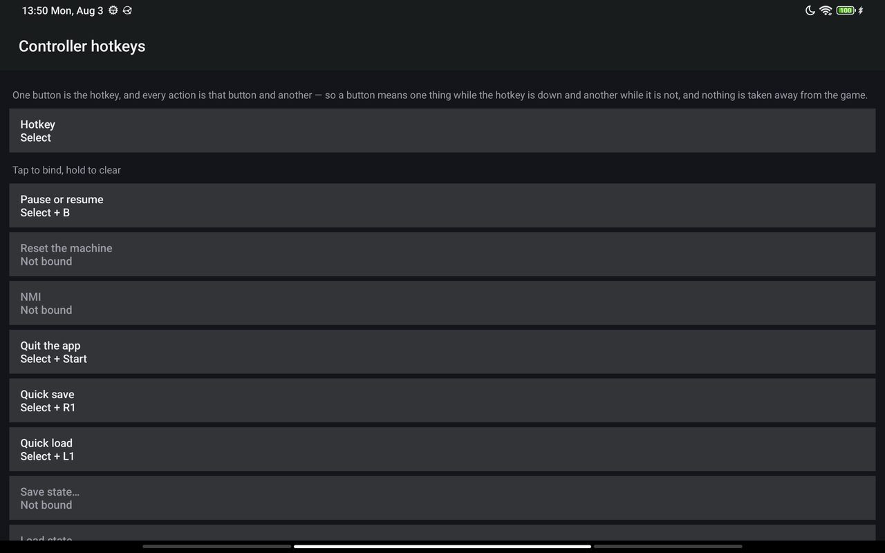</a>

Plug one in and it works — no mapping screen. Stick, hat and D-pad steer, A is
fire, B, X and Y are the key buttons, Start is Enter, and the on-screen pad
steps aside.

Hotkeys are RetroArch style: one button is the hotkey, and every action is that
button and another, so nothing is taken from the game. The hotkey is Select by
default and can be any button, or None, in which case bindings fire on their
own. Twenty-two actions to bind; nine out of the box:

| Action | Button |
| --- | --- |
| Pause or resume | Select + B |
| Quit the app | Select + Start |
| Quick save | Select + R1 |
| Quick load | Select + L1 |
| Fast forward | Select + R2, while held |
| Fullscreen | Select + X |
| Show or hide the keyboard | Select + Y |
| Next key profile | Select + R3 |
| Next joystick type | Select + L3 |

Fast forward runs at 500% and stays silent. Rebind in ☰ *Controls… ›
Controller hotkeys…*: tap a row, press the button.

## Profiles

<a href="docs/screenshots/key-profile.jpg">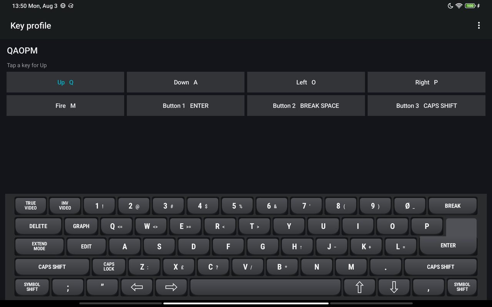</a>
<a href="docs/screenshots/settings-controls.jpg">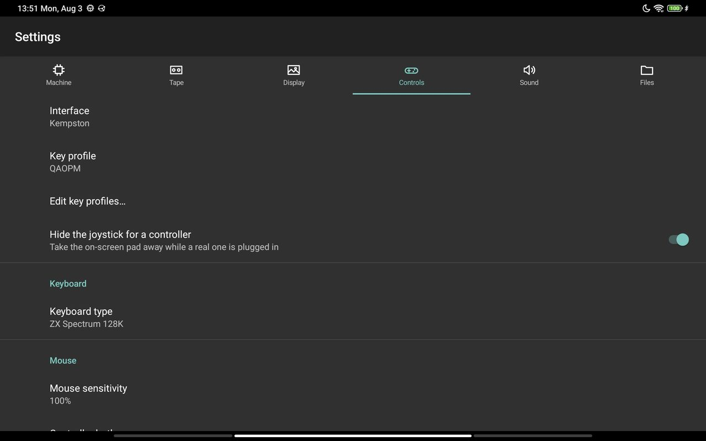</a>

The joystick comes out as any of the Spectrum's seven interfaces — Kempston,
Cursor, Sinclair 1 and 2, Timex 1 and 2, Fuller — or as keys. Key profiles
cover QAOPM, QAOP and Space, the cursor keys, both Sinclair sets and WASD, and
you can copy any of them, edit the eight keys, and delete what you no longer
want.

Interface, profile, keyboard and mouse all change from the bar across the top of
the window, mid-game.

## Touch

<a href="docs/screenshots/landscape.jpg">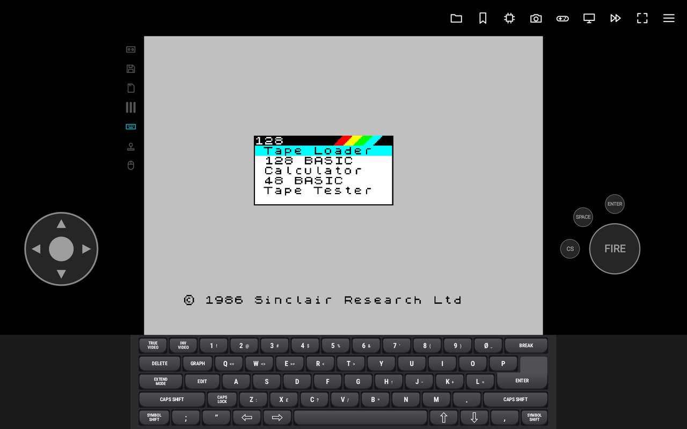</a>

The on-screen joystick is a thumb pad, fire and three key buttons in an arc, put
where the picture leaves room and laid over it, translucent, when it does not.

Four keyboards, drawn rather than photographed, so they stay sharp at any size:
the rubber 48K and the 128K plate, each also slim with the BASIC left off. Every
key carries its keyword, symbol-shift character, colour and extended-mode token,
in the colours the machine printed them in. Two fingers give a shifted key; hold
a shift for 400ms and it latches until tapped again. Your own input method is
there too as a fifth choice.

<a href="docs/screenshots/keyboard-48k.jpg">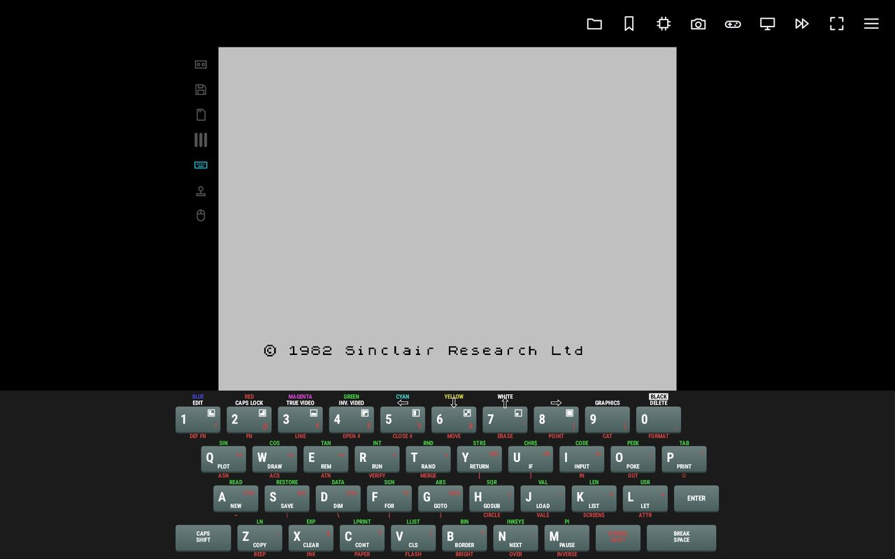</a>
<a href="docs/screenshots/keyboard-128k.jpg">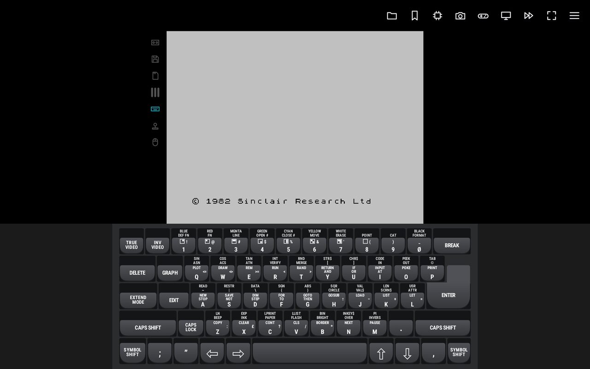</a>

Whenever no keyboard is on screen — you put it away, or you are in fullscreen —
a button by the pad raises a see-through one over the picture instead, in
whichever skin you chose, and the joystick stays put, so a game wanting a key
and a stick at once can have both.

**Kempston mouse** — a mode. While on, a drag moves the pointer, and fire and
the first key button are its buttons. Sensitivity is a setting.

## Cheats

<a href="docs/screenshots/cheats.jpg">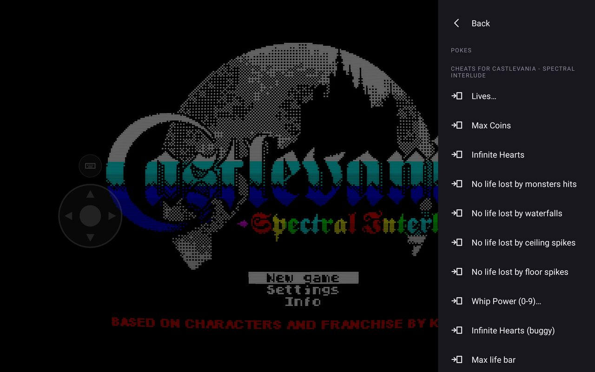</a>

Cheats for 3,682 games are built in, matched by the file's fingerprint or by
name. Ones that take a number ask for it. Pokes of your own can be fired once or
kept on a list; decimal, or hex after `0x`, `$` or `#`.

## Capture

Screenshots as PNG, and recording to GIF or MP4. All three go to
`Pictures/Zedex` and show up in your gallery, named after whatever is running.

## The machines

| Family | Machines |
| --- | --- |
| Sinclair | 16K · 48K · 48K NTSC · 128K · +2 · +2A · +3 · +3e |
| Timex | TC2048 · TC2068 · TS2068 |
| Clones | Pentagon 128K · 512K · 1024K · Scorpion ZS 256 |
| Other | Spectrum SE |

- Speed 25%–500%, reset, NMI, Issue 2 keyboard
- AY-3-8912 in ACB or ABC stereo, on the 128K family
- Beta 128 and TR-DOS, drives A:–D:, on the Pentagons and the Scorpion
- The +3 floppy, drives A: and B:
- DivMMC and a memory card, on any machine
- Timex SCLD video and its hi-res modes
- A tape deck that reads and writes
- Kempston mouse

<a href="docs/screenshots/media.jpg">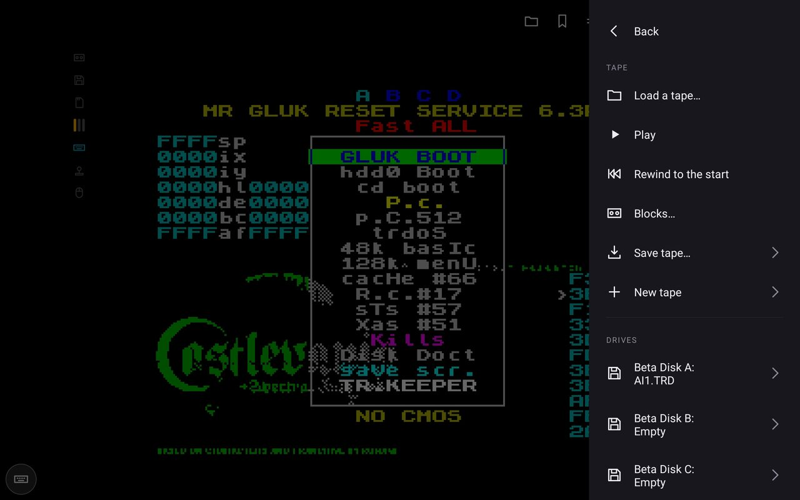</a>

## Files

Snapshots, tapes, disks, cartridges, microdrive images and RZX recordings. The
file identifies itself, and the machine switches when the media needs one — a
`.dsk` brings up a +3, a `.trd` a Beta-equipped machine.

- Opens files handed over by other apps
- Fast tape loading: off, safe (ROM loaders), or turbo (custom loaders too)
- Writes tapes and disks out, or back over the file they came from
- Recent files: the last ten
- A demo tape in your tapes folder — the first run says where
- The machine ROMs are put there for you, and kept in the app's own storage
  instead if that folder ever cannot hold them — nothing to do either way

<a href="docs/screenshots/settings-tape.jpg">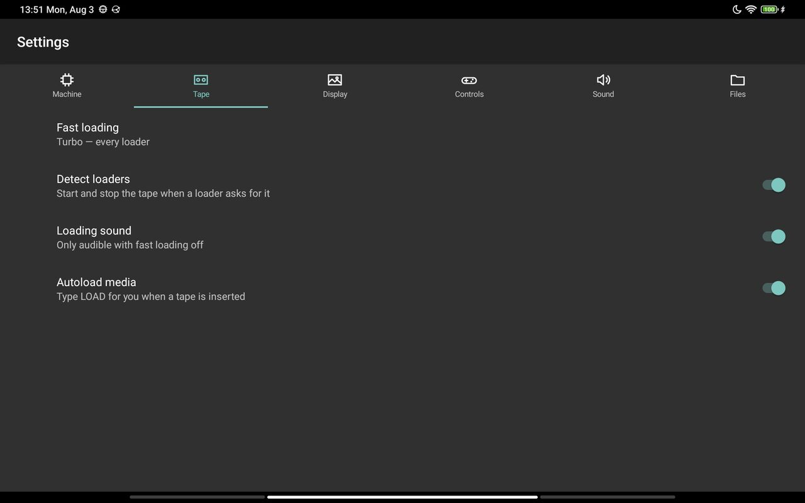</a>

**First start** asks for two folders; both can be changed later in *Settings ›
Files*.

Files the app writes there are yours to open, copy and delete. Files you copy
*in* are a different matter: Android hands an app only what it wrote itself, so
a tape dropped into `tapes` from a computer is invisible to the app and has to
be opened through *Open file…* instead — which remembers it afterwards. The
build from Releases here can additionally be granted All files access, and then
any folder will do, `/storage/emulated/0/Zedex` included; the Play build cannot,
because Play does not allow that permission to an app that works without it.

| | |
| --- | --- |
| Data folder | `roms`, `states`, `tapes`, `disks`, `cards`. **`/storage/emulated/0/Documents/Zedex`** by default — a folder any file manager can open, and one the app needs no permission at all to use. Screenshots and recordings are not in it: they go to `Pictures/Zedex`, which is what puts them in your gallery |
| Content folder | where *Open file…* starts, on the first open after each launch |

<!--  — the two folder cards and the note about the demo tape -->

## Getting around

**The quick bar** — a strip across the top of the window, either way up. Tap the
picture to bring it back; it fades after three seconds.

| | |
| --- | --- |
| Files | open one, and the last ten |
| States | save, load, and the quick pair named after what is running |
| Machine | pause, change machine, reset, NMI |
| Capture | screenshot, GIF, MP4, and the folder they go to |
| On screen | the keyboard and the joystick, and the four settings worth changing mid-game: joystick interface, key profile, keyboard, mouse |
| Display | scanlines, CRT, video output, border, lamps |
| Fast forward | hold for 500%, silent |
| Fullscreen | |

<a href="docs/screenshots/main-menu.jpg">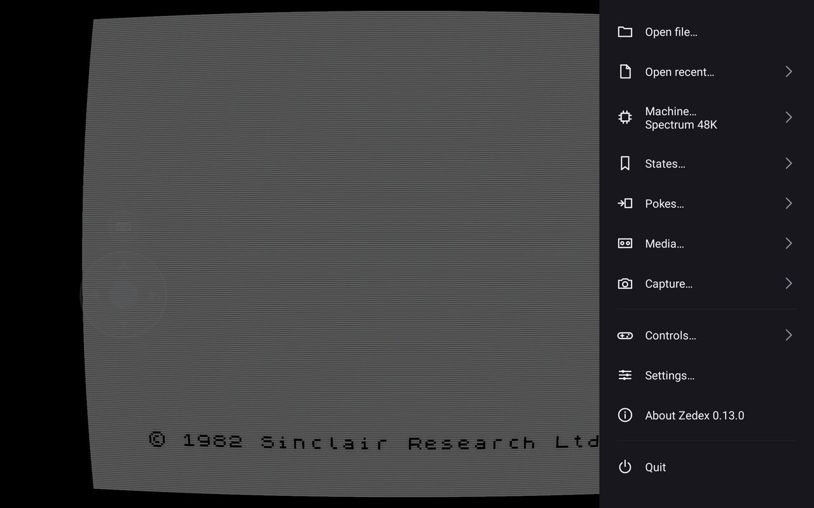</a>

**☰** has *Open file…*, *Open recent…*, *Machine…*, *States…*, *Pokes…*,
*Media…*, *Capture…*, *Controls…*, *Settings…* and *Quit*. **Back** never
exits: it leaves fullscreen, or goes up a menu page, or opens ☰. *Quit* warns
about unsaved disks first.

**Settings** has six tabs — Machine, Tape, Display, Controls, Sound, Files.
Everything that persists is there, exactly once; ☰ and the bar are shortcuts to
the same settings.

**Activity lamps** — tape, disk, memory card, AY, keyboard, joystick, mouse.
Blue reads, amber writes; the AY is three bars, one per channel. A lit joystick
lamp with a dead stick means the game wants a different interface.

Fullscreen gives the picture their strip back, and keeps one of them: the disk,
over the corner of the picture, for as long as a drive is turning and not a
moment longer. It is the lamp that answers "is it safe to close this yet".
Turning the indicators off in *Settings › Display* turns that off too.

## The memory card

A DivMMC with esxDOS on it. Two things are yours to bring:

1. **Firmware.** `ESXMMC.BIN`, the 8K DivMMC build, from
   [esxdos.org](http://www.esxdos.org/). *Settings › Machine › DivMMC firmware*.
2. **A card image.** ☰ *Media… › Insert card…*. An `.hdf`, or a raw image such
   as a MiSTer `.vhd`, which gets an HDF header written for it. It needs
   esxDOS's own `BIN` and `SYS` folders on it.

Switch on *DivMMC interface* in the same place; the machine resets. Then `.ls`
lists the card, `.` commands are esxDOS's, and ☰ *Machine… › NMI* opens its file
browser. Changes are written back once a second and whenever the app is paused.

## No ads, no tracking

No advertising, no analytics, no accounts, nothing collected about you. The
whole app carries a single library, for one settings screen. Two permissions:
files, so your folder is somewhere you can reach, and internet, used for exactly
one thing — fetching a ROM set, if you ever ask it to. The full account is in
[docs/PRIVACY.md](docs/PRIVACY.md).

## Not yet

- A file browser of our own, filtered by type and reading zip archives.
  Android's picker cannot filter by extension
- A library rather than a list of filenames: cover art, loading screens, maps,
  manuals, the publisher and the year, looked up in ZXDB and the archives behind
  it and kept on the device for offline use
- A debugger, which the core supports and nothing yet exposes

## Licence

Zedex is free software under the **GNU General Public License, version 2 or (at
your option) any later version**. The full text is in [LICENSE](LICENSE).

`vendor/` keeps its own upstream copyright — see `vendor/fuse-1.9.0/AUTHORS` and
`vendor/libspectrum-1.6.2/AUTHORS`. Everything outside it is © 2026 Dmitrii
Leshchenko.

The name **Zedex** and the app icon are not covered by the GPL, which grants no
trademark rights. Fork the code freely; ship it under your own name.

**The ROMs are not under the GPL and are not ours.** Most are Fuse's set,
redistributed by permission of the copyright holders — Amstrad for the Sinclair
machines, others for the rest. [README.copyright.md](roms/README.copyright.md)
is that permission, copied from Fuse whole. **No games are included.**

**The demo's music is not ours.** The tune the shipped demo tape plays is *Time
Up* by [shiru8bit](https://opengameart.org/users/shiru8bit), from OpenGameArt
under **CC-BY 3.0**, used with attribution and otherwise unchanged.

**The cheats are not ours.** They come from
[The Tipshop](https://www.the-tipshop.co.uk/), run by Gerard Sweeney. The
machine-readable form is *AllTipshopPokes*, gathered by Lady Eklipse and
distributed with
[ZX Pokemaster](https://github.com/eklipse2009/all-tipshop-pokes).
